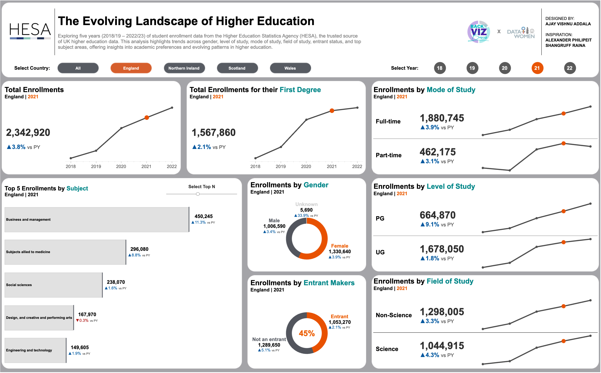

# The Evolving Landscape of Higher Education  

### Project Overview  
This project explores trends in higher education enrollments across the UK from 2018/19 to 2022/23 using data provided by the **Higher Education Statistics Agency (HESA)**. The analysis focuses on identifying patterns in student enrollments by various dimensions, including:  
- Gender  
- Level of Study (Undergraduate/Postgraduate)  
- Mode of Study (Full-time/Part-time)  
- Field of Study  
- Entrant Status (First-Year Students)  
- Top Subject Areas  

This visualization celebrates **International Women’s Day 2025** as part of a collaboration with **Data + Women London**, emphasizing the importance of tracking educational trends to foster meaningful discussions and insights.  

---

### Dataset  
The dataset is sourced from **HESA**, which collects, assures, and publishes higher education data in the UK. Fields include:  
- **CAH Level 1:** Subject area classification  
- **Entrant Marker:** Identifies first-year students  
- **Level of Study:** Undergraduate or postgraduate  
- **Mode of Study:** Full-time or part-time  
- **Country of HE Provider:** Region of the institution in the UK  
- **Sex:** Gender of enrolled students  
- **Academic Year:** Enrollment year (2018/19 - 2022/23)  
- **Number:** Count of enrolled students  

For more details about HESA and its mission, visit their [official website](https://www.hesa.ac.uk).  

---

### Key Visualizations  
1. **Enrollment Trends by Academic Year**  
   - Displays total enrollments over five years, categorized by gender, level of study, and mode of study.  
2. **Top Subject Areas**  
   - Highlights the most popular fields of study across academic years.  
3. **Entrant Analysis**  
   - Focuses on first-year students, showcasing trends by subject area and mode of study.  
4. **Field of Study Breakdown**  
   - Examines enrollment patterns across various academic disciplines.  

---

### Snapshot  
Below is a snapshot of the Tableau dashboard:  

  

---

### Tableau Dashboard  
Explore the full interactive visualization here: [Tableau Dashboard Link](https://public.tableau.com/views/EvolvingLandscapeofHigherEducationinUKB2VB205W4DATAWOMENLONDON/Enrollments_B2VB_DataW?:language=en-US&:sid=&:redirect=auth&:display_count=n&:origin=viz_share_link)  

---

### About the Collaboration  
This project was created as part of the **Makeover Monday Week 4 Challenge (2025)** in collaboration with **Data + Women London** to celebrate **International Women’s Day**.  

**Data + Women London** is a community that celebrates and promotes the achievements of women in data. Learn more about their initiatives:  
- [User Group](https://www.meetup.com/Data-Women-London/)  
- [LinkedIn](https://www.linkedin.com/groups/8674672/)  

---
